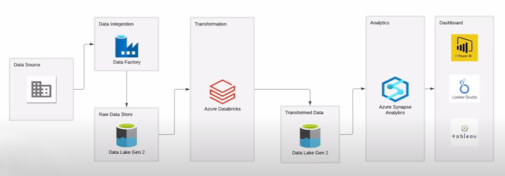

# Olympics Data Pipeline on Azure

This repository contains a comprehensive data pipeline for the Olympics dataset, built using various Azure services. The pipeline is designed to extract, transform, and load data efficiently, enabling analytics.

## 📦 Architecture Overview

The architecture consists of the following components:

1. **Data Source**: Raw data is ingested from multiple sources.
2. **Data Integration - Azure Data Factory**: Data is ingested and stored in Azure Data Lake Gen 2 in its raw form.
3. **Transformation - Azure Databricks**: Data is processed and transformed using Apache Spark.
4. **Storage - Azure Data Lake Gen 2**: Transformed data is stored in a separate container for analytics.
5. **Analytics - Azure Synapse Analytics**: Data is queried, aggregated, and prepared for visualization.

## 🚀 Features

- Seamless data ingestion using Azure Data Factory.
- Scalable data transformation using Azure Databricks.
- Data storage and management with Azure Data Lake Gen 2.
- Analytics and querying using Azure Synapse.

## 🔧 Prerequisites

- Azure Data Factory
- Azure Data Lake Gen 2
- Azure Databricks
- Azure Synapse Analytics

